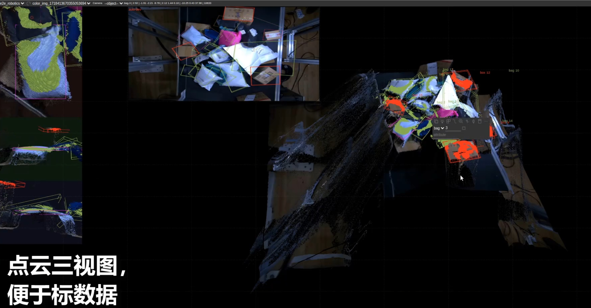

# 具身智能端到端机械臂  数据标注工具

### 工具介绍 (点击图片跳转YouTube视频)
github仓库里也有视频可供下载，路径在```doc/20240909标注工具介绍.mp4```

[](https://www.youtube.com/watch?v=6eklVXlqUR8)


## Get started

[安装教程](./doc/install_from_source.md)

## Operations
[快捷键](./doc/shortcuts_cn.md)

## 标注要求(待更新)
[标注要求](doc/requirement.md)